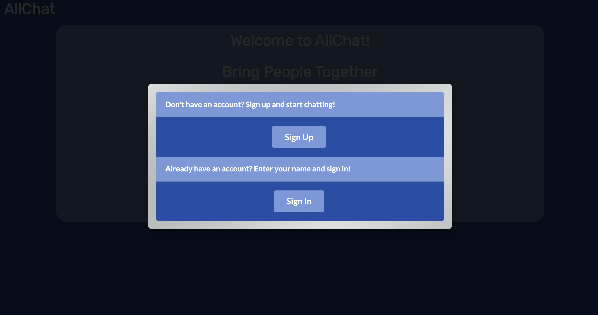
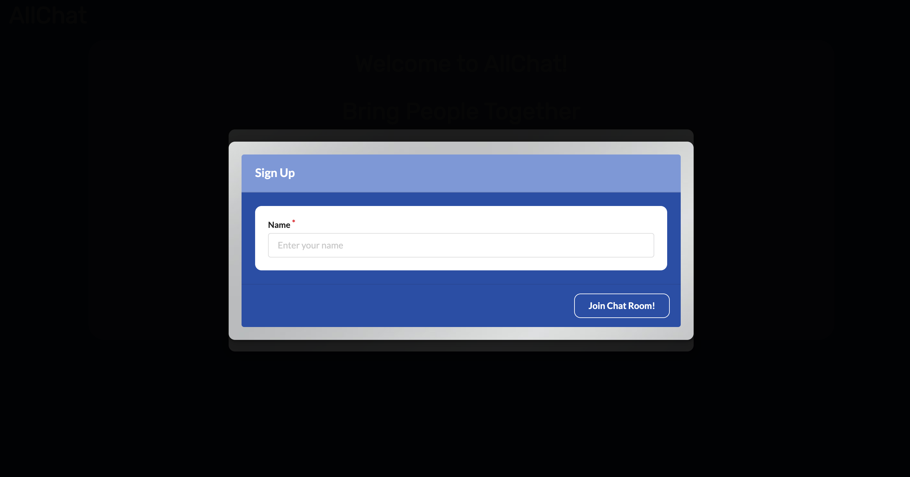
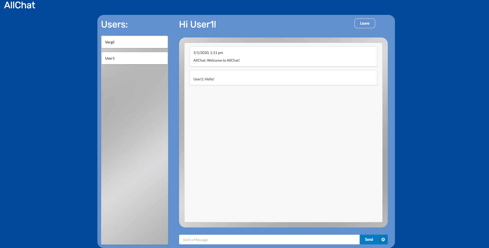

# AllChat Messaging App

Much like other messaging apps, AllChat connects people from all around the world and all walks of life. However, unlike other messenger services, AllChat allows its users to effectively communicate, even if they do not speak the same language.

## Motivation

As communication continues to increase on a global scale, so too does the demand for quick, reliable translation.

## Build Status

Currently able to create a user and sustain a single chat room shared by multiple users. Sign-in authentication, multiple chat rooms, and dynamic translation of messages are still in progress. 

## Code Style

## Screenshots

## Tech/Framework Used

- ReactJS
- ReactDOM
- ReactRouterDOM
- Semantic-UI-React
- CSS
- Socket.IO
- MySQL
- Express
- React-Moment
- Moment-Timezone

## Features

There are many different messaging apps out there. You got the default messenger on your typical smartphone; that will let you communicate across the country. Facebook Messenger and WhatsApp allow you to connect with people outside your country, but what if you wanted to talk to someone in France, but couldn't speak a lick of French? 

That's where AllChat comes in. 

AllChat utilizes its built-in API to automatically translate the sender's message into the recipient's native language, allowing for more intuitive international communication. Whether its for sealing that important business deal, or discovering that special someone from across the globe, AllChat brings us all closer together.

## Code Example

## Installation

## Tests

## How To Use?

On the landing page, click "Get Started" and enter a username into the modal, then click "Join Chat Room". Once on the chat page, you can message other users who are currently signed in. If you wish to exit the chat, and sign up using a different name, click the "Leave" button in the top-right corner, and repeat the aforementioned steps.

## Contribute

## Credits

- Paul Han, 
- Suneetha Burla, 
- James Geib, Front-end styling,

## License
